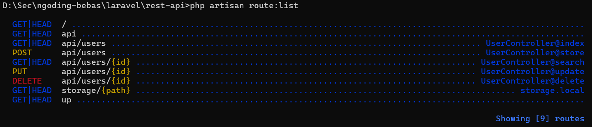
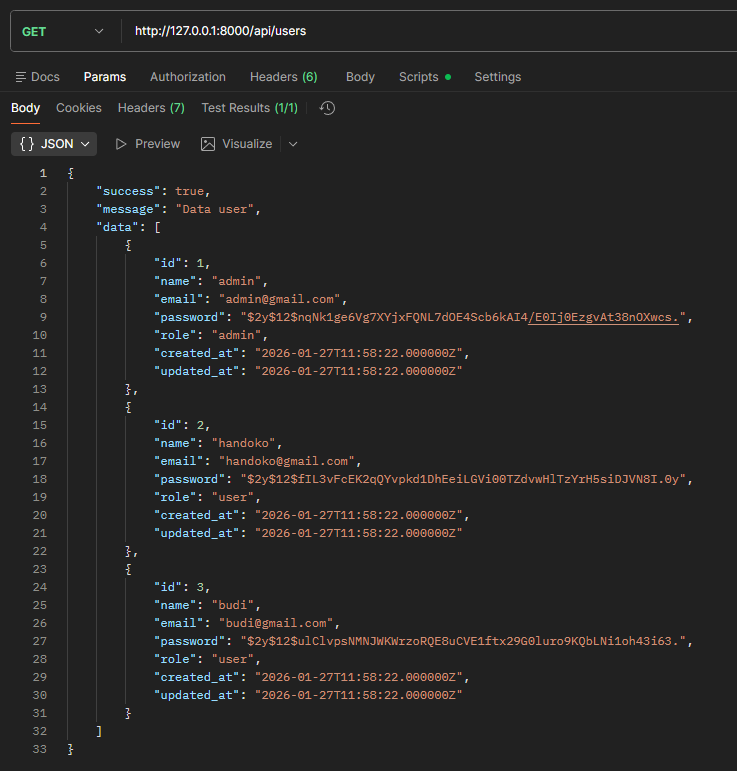
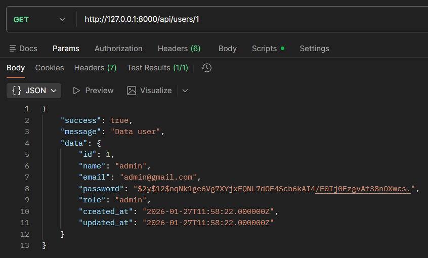
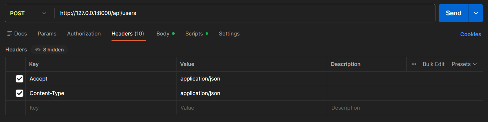
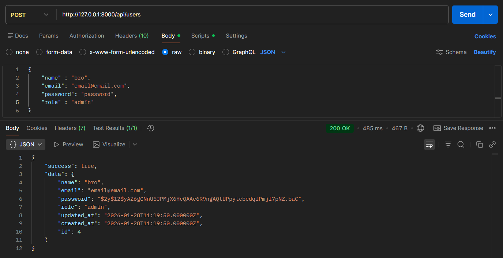

# Laravel Basic CRUD User

Project ini adalah aplikasi **Laravel Basic CRUD (Create, Read, Update, Delete)** untuk manajemen data **User**.  
Cocok untuk pembelajaran dasar Laravel seperti **migration, model, seeder, controller, dan routing**.

---

## 🚀 Fitur
- CRUD User (Create, Read, Update, Delete)
- Role User (`admin`, `user`)
- Validation form
- Search User
- Seeder data user
- Struktur Laravel standar

---

## 🧰 Teknologi
- Laravel 12
- PHP >= 8.2
- MySQL (xampp)
- Composer
- Postman

---

## ⚙️ Instalasi

### 1. Clone Repository
```bash
git clone https://github.com/sodiumKlorida/laravel-basic-crud.git
```
Setelah melakukan clone, masuk directory dengan cara
```bash
cd laravel-basic-crud
```

### 2. Install Depedency
```bash
composer install
```
tunggu hingga selesai


Buat file .env baru
```bash
cp .env.example .env
```
Lalu generate key baru
```bash
php artisan key:generate
```

### 3 Konfigurasi Database
buka file .env lalu modifikasi kode seperti ini
```bash
DB_CONNECTION=mysql
DB_DATABASE= (nama database kamu)
DB_USERNAME=root
DB_PASSWORD=
```

### 4 Migration & Seeder
Jangan lupa untuk menyalakan database server xampp/laragon
```bash
php artisan migrate:fresh --seed
```
Seeder akan membuat:
- User Admin
- User Biasa


### 5 Jalankan Laravel
```bash
php artisan serve
```

---

## 📃 Endpoint API
### 1 Cek Route Terlebih Dahulu
```bash
php artisan route:list
```



### 2 Get Data User
Endpoint get all data user
```bash
http://127.0.0.1:8000/api/users
```
Uji coba pada postman



### 3 Seach Data by Id User
Endpoint get data user by id
```bash
http://127.0.0.1:8000/api/users/1
```
Uji coba pada postman



### 4 Input New Data User
Endpoint post untuk data user baru
```bash
http://127.0.0.1:8000/api/users
```
Seting header terlebih dahulu



Input data baru seperti ini
```bash
{
	"name" : "bro",
    "email": "email@email.com",
    "password": "password",
    "role" : "admin"
}
```
Setelah menyetting header perdi ke body lalu :

body->raw->ubah text menjadi JSON

Maka akan terlihat seperti ini



