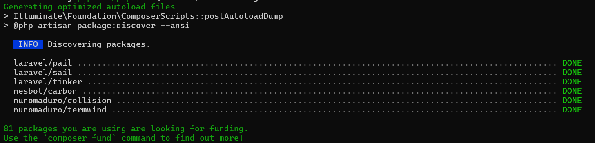
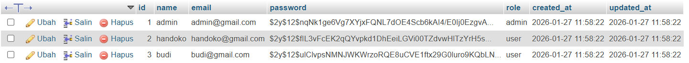

# Laravel Basic CRUD User

Project ini adalah aplikasi **Laravel Basic CRUD (Create, Read, Update, Delete)** untuk manajemen data **User**.  
Cocok untuk pembelajaran dasar Laravel seperti **migration, model, seeder, controller, dan routing**.

---

## 🚀 Fitur
- CRUD User (Create, Read, Update, Delete)
- Role User (`admin`, `user`)
- Validation form
- Search User
- Seeder data user
- Struktur Laravel standar

---

## 🧰 Teknologi
- Laravel 12
- PHP >= 8.2
- MySQL
- Composer

---

## ⚙️ Instalasi

### 1. Clone Repository
```bash
git clone https://github.com/sodiumKlorida/laravel-basic-crud.git
```
Setelah melakukan clone, masuk directory dengan cara
```bash
cd laravel-basic-crud
```

### 2. Install Depedency
```bash
composer install
```
tunggu hingga selesai

<<<<<<< HEAD

=======

>>>>>>> 45af9d4c35cc19c93e5e5d641dce0102f88f423e

Buat file .env baru
```bash
cp .env.example .env
```
Lalu generate key baru
```bash
php artisan key:generate
```

### 3 Konfigurasi Database
buka file .env lalu modifikasi kode seperti ini
```bash
DB_CONNECTION=mysql
DB_DATABASE= (nama database kamu)
DB_USERNAME=root
DB_PASSWORD=
```

### 4 Migration & Seeder
```bash
php artisan migrate:fresh --seed
```
Seeder akan membuat:
- User Admin
- User Biasa

